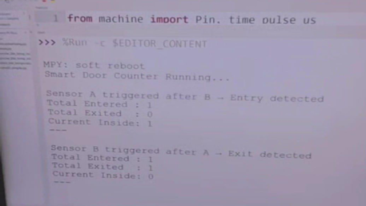

# Smart Door Monitoring System Using Raspberry Pi Pico W

## Overview

This project is an IoT-based Smart Door Monitoring System developed using Raspberry Pi Pico W and HC-SR04 ultrasonic sensors. The system detects entry and exit events by monitoring the sequence in which two ultrasonic sensors are triggered and maintains a real-time count of people inside the room.

## Features

- Real-time entry and exit detection
- Dual HC-SR04 ultrasonic sensors
- Raspberry Pi Pico W implementation
- Automatic people counting
- Live serial monitor output
- Lightweight embedded system
- Indoor occupancy monitoring

## Technologies Used

- Python
- MicroPython
- Raspberry Pi Pico W
- HC-SR04 Ultrasonic Sensor
- Embedded Systems
- IoT

## Project Output

### Smart Door Monitoring Output



## Installation

### Clone the repository

```bash
git clone https://github.com/SanjanaT123/Door-Sensor.git
```

### Open the project

Upload the MicroPython files to the Raspberry Pi Pico W using Thonny IDE.

### Run the application

Power the Raspberry Pi Pico W and monitor the serial output for entry and exit detection.

## Project Structure

```
Door-Sensor
│
├── main.py
├── door_sensor.py
├── README.md
└── images
    └── output.png
```

## Skills Demonstrated

- Embedded Systems
- Raspberry Pi Pico W
- IoT Development
- Python Programming
- MicroPython
- Ultrasonic Sensors
- Sensor Integration
- Real-Time Monitoring

## Future Enhancements

- LCD display integration
- Buzzer alert system
- Cloud-based occupancy monitoring
- Mobile application
- Email notifications
- Data logging dashboard

## Repository

This repository demonstrates a smart door monitoring system developed using Raspberry Pi Pico W and dual HC-SR04 ultrasonic sensors. The project detects entry and exit events based on sensor triggering order and maintains real-time occupancy information, showcasing practical embedded systems and IoT application development.

## Author

Sanjana Tupped

GitHub: https://github.com/SanjanaT123

LinkedIn: https://www.linkedin.com/in/sanjana-tupped-8a9119381/
